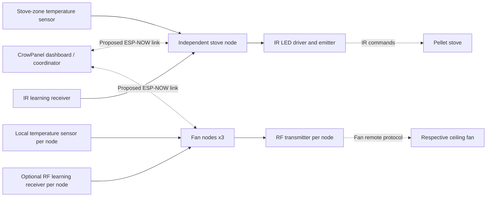

# Arduino TCM board design — Rev A planning

Status: native KiCad electrical draft created; physical socket and RF details remain unverified. No PCB or fabrication files.
Firmware baseline: commit 651ab30, Arduino_TCM_Blynk_DHT11.ino.

Circuit work: see [shared node circuit draft](node-circuit-draft.md) and `node-circuit-model.json` for proposed component values, connectivity, GPIO assignments and stove/fan assembly variants. These supersede the early connector concepts below. Native schematic: `tcm_node_rev_a_draft.kicad_sch`; project: `tcm_node_rev_a_draft.kicad_pro`. The repository now resides in C:/Projects/Arduino_TCM. Initial ERC passed with zero errors and warnings; the exported connections matched the design model. See preview/ for SVG and PNG views. This does not validate real hardware compatibility.

## Scope and decisions

Accepted architecture: one ELECROW CrowPanel Basic 7-inch dashboard/coordinator, one independent stove-control node, and three fan nodes. Five ESP32 devices total. The user selected independent stove control so a dashboard restart or update does not itself stop the stove node's local control loop. Fan nodes transmit RF commands; the stove node transmits IR commands. No wired appliance-power switching is required.

Working PCB direction: one common carrier PCB with different component population for stove and fan roles. Plug-in ESP32 development boards remain the working preference; exact model and mechanical fit are pending. The CrowPanel already includes its own ESP32 and does not require this carrier to operate its display.

| Role | Quantity | Planned peripherals |
| --- | ---: | --- |
| CrowPanel dashboard | 1 | Built-in display/touch and ESP32; user settings, zone overview and wireless coordination |
| Stove node | 1 | Local temperature sensor, IR emitter/receiver; independent local control |
| Fan node | 3 | Local temperature sensor, RF transmitter, optional RF learning receiver; wireless command/telemetry link |

The existing firmware transmits all fan commands from the main controller, and the remote sketch is a sensor node. Distributed fan control therefore requires firmware changes: addressed commands, node registration, acknowledgements, duplicate suppression, freshness limits, local code storage and explicit lost-link behavior. ESP-NOW is the provisional inter-board transport because the repository already uses it. Channel coordination with the main controller's Wi-Fi connection must be designed and tested.

An acknowledgement from a fan node confirms command handling/transmission, not physical fan operation. RF toggle commands, especially light toggles, must not be re-executed on network retries. Keep desired state and last transmitted state distinct from any independently confirmed state.

RF frequency, modulation and protocol are unverified. The repository assumes 433 MHz and uses RCSwitch; do not select a production RF module from that assumption alone. Obtain each remote's model/FCC ID or manufacturer documentation and verify capture/replay compatibility. Nearby placement does not isolate fans that share the same RF address; pairing/address behavior must also be tested.

Exact node ESP32 and RF module models, sensor choice, input supply, enclosure dimensions and assembly preference must be selected before footprints and board outline are finalized. Do not assume different ESP32 development boards share header spacing or pin order. Confirm the CrowPanel model and PCB revision against ELECROW documentation before firmware bring-up; the Amazon listing title alone does not establish the revision.

## Control responsibilities

### Node board candidate and power decision

All four custom nodes will use USB wall adapters (confirmed by user). The nominated plug-in board is the ideaspark ESP32 development board with integrated 1.14-inch ST7789 135x240 display, CH340 USB serial, USB-C and soldered headers, as described in the user's listing title. Treat it as the current candidate, pending verified header pinout, row spacing, outline, underside clearance and power schematic. Do not substitute a generic ESP32 DevKit footprint.

The local display can show node identity, temperature, connection health and last transmitted command. The existing repository already targets an ST7789 at this resolution, but this does not establish electrical compatibility or successful operation on the candidate board. Preserve integrated display wiring; any earlier suggestion to move LCD CS/DC applies only to separately wired displays, not fixed PCB connections. Reserve firmware LCD GPIOs 23, 18, 15, 2, 4 and 32 provisionally until the actual board pinout is verified.

Keep the USB connector and screen accessible when placing the carrier sockets. Determine how peripheral power is drawn from USB without overloading the onboard regulator or creating a second power path. RF module supply and connector remain unresolved until remote identification; leave the RF module interface modular in the architecture, not a finalized footprint.

Candidate listing supplied by user: https://a.co/d/050E23FP . No mechanical drawing or manufacturer schematic has yet been verified.

### Firmware ownership

- Dashboard: present room measurements and node health, send settings and manual requests, coordinate fan behavior, and optionally provide the Blynk bridge.
- Stove node: own IR timing, learned codes, heat-adjustment cooldown and the local control loop. Dashboard requests pass through the node's control logic. Define startup behavior, sensor-fault behavior and loss of remote-temperature data before enabling automation.
- Fan nodes: own RF transmission and learned codes; report local temperature and command acknowledgements. Define loss-of-link behavior explicitly rather than assuming an automatic off command is appropriate.
- All nodes: report measurement age, fault state and last applied command ID. Reject stale requests and suppress duplicate actions. A screen restart must not replay an old power/light toggle.
- Autonomous stove operation is a design objective, not a claim of implemented behavior. Persistence, restart handling and fallback from a stale remote zone still require implementation and bench validation.

## Functional architecture

## Firmware pin inventory

These are GPIO numbers, not module pad numbers or development-board header positions. This inventory describes the existing centralized firmware; the fan-node pin map remains to be finalized.

| Function | Existing GPIO | Board-design consideration |
| --- | ---: | --- |
| DHT data | 13 | Pull-up to the selected sensor-compatible logic rail; verify exact sensor supply specification |
| IR receiver output | 14 | Verify receiver supply, output levels and physical pin order |
| IR transmitter control | 5 | Boot-strapping pin; proposed reassignment to GPIO25 if the chosen ESP32 supports it |
| RF transmitter data | 16 | Confirm availability on exact ESP32 variant and transmitter input threshold |
| RF receiver data | 17 | Confirm availability and receiver output voltage; translate levels if needed |
| LCD MOSI | 23 | Verify display connector pin order |
| LCD SCLK | 18 | Keep SPI connections short |
| LCD CS | 15 | Preserve integrated display wiring; do not load with carrier circuitry |
| LCD DC | 2 | Preserve integrated display wiring; do not load with carrier circuitry |
| LCD reset | 4 | Retain provisionally |
| LCD backlight enable | 32 | Verify whether module pin is a logic input or requires a current driver |

The proposed changes apply provisionally to a classic ESP32 with those pins available. They have not been applied to firmware. GPIO16/17 availability must be checked against the chosen module, including any PSRAM usage.

## Proposed connector functions

Pin order and connector part numbers are intentionally pending the actual hardware.

| Reference | Interface | Signals / requirements |
| --- | --- | --- |
| J1 | Power input | Supply and ground; input voltage and connector TBD |
| J2 | Local sensor | Sensor supply, ground, DHT data; short external cable allows separation from board heat |
| J3 | IR emitter | Current-limited LED supply and switched return; polarity marked |
| J4 | IR receiver | Selected receiver supply, ground, data |
| J5 | RF transmitter | Selected module supply, ground, data; antenna arrangement per module |
| J6 | RF receiver | Selected module supply, ground, level-compatible data |
| J7 | Reserved | No separate LCD connector required; display is on the CrowPanel |
| J8 | Programming/service | Defined after MCU choice; integrated module needs UART/reset/boot provision |

## Electrical work before schematic freeze

- Build separate power budgets for the CrowPanel and each node, covering radio transients and RF/IR loads. Espressif specifies at least 500 mA supply capability for the classic ESP32 itself; this is not a complete node budget. All four nodes use USB wall adapters; exact adapter rating and available peripheral current remain to be verified.
- If using a development board, verify its regulator capacity and USB/external-power path. Prevent backfeeding when programming with another supply attached.
- If using an integrated module, implement its specified supply decoupling, enable/reset timing, boot control, programming interface and antenna keepout.
- Correct the README's ambiguous IR circuit: supply -> current-limiting resistor -> LED anode; LED cathode -> transistor collector/drain; emitter/source -> ground. Select a transistor driven correctly at 3.3 V, a default-off control network, and resistor ratings from the actual LED pulse limits and duty cycle. Do not copy the existing drawing or its resistor values without calculation.
- Verify every peripheral's supply and logic limits. A module powered at 5 V must not automatically be treated as safe for a 3.3 V ESP32 input.
- Verify sensor voltage requirements from its manufacturer; module pull-ups may connect data to its supply rail.
- Use the CrowPanel's onboard display/backlight circuitry and revision-specific drivers. The legacy ST7789 pin map is not the CrowPanel pin map.
- Provide test points for input supply, 3.3 V, ground and key control signals. Keep IR pulse-current return paths away from receiver and sensor circuitry.
- Place ESP32 antenna at a suitable edge with the exact module's specified keepout. Keep regulator/processor heat away from the temperature sensor.

## Next deliverables

1. Confirm exact modules, supply and mechanical constraints.
2. Select component part numbers and datasheets, then draw a native KiCad schematic and resolve electrical-rule findings.
3. Assign verified footprints; place connectors and mounting holes against the enclosure.
4. Route the PCB, check schematic parity and design rules, and inspect fabrication previews.
5. Bring up power first, then programming/boot, sensors, display, RF and IR. Test cold boot and reset with every peripheral connected.

## References

- Existing firmware: ../Arduino_TCM_Blynk_DHT11/Arduino_TCM_Blynk_DHT11.ino
- Espressif schematic checklist: https://docs.espressif.com/projects/esp-hardware-design-guidelines/en/latest/esp32/schematic-checklist.html
- ESP32 datasheet: https://documentation.espressif.com/esp32_datasheet_en.html
- ESP32 hardware design guidelines: https://documentation.espressif.com/esp-hardware-design-guidelines/en/latest/esp32/index.html
- CrowPanel Basic 7-inch documentation: https://www.elecrow.com/wiki/esp32-display-702727-intelligent-touch-screen-wi-fi26ble-800480-hmi-display.html

## A1 socket mapping

J1 and J8 now represent the two 15-position ideaspark header rows, mapped from the original product pinout image. See [socket map](ideaspark-socket-map.md). The A0 logical port is superseded. Mechanical spacing and the USB/VIN power path remain unresolved.

## A2 discrete footprints and assembly plan

Fourteen discrete components now have library footprints: 0805 small resistors and bypass capacitors, 2010 IR current resistor, 1210 bulk capacitors, and SOT-23-3 MOSFET. Eight connector footprints remain pending. See [parts and assembly plan](parts-and-assembly.md). ERC and netlist results are recorded in validation/. No PCB or manufacturing release is produced.
